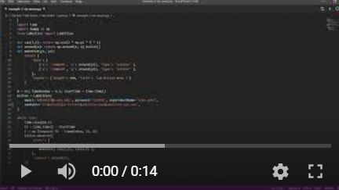
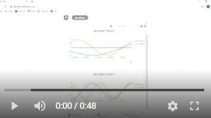

# [App home page (click me)](https://lab-kitten.github.io)

- In the lab computer, run: [**example-2-sin-waves.py**](https://github.com/lab-kitten/lab-kitten/blob/master/python/example-2-sin-waves.py)

- Then on your phone or home computer you get:

# Introduction

- `lab-kitten` is toolkit for labs / experiments originally developed by [Ding Ruiqi](https://github.com/tesla-cat) for [Yvonne Gao’s quantum computing lab](https://quantumcrew.org/) at National University of Singapore (NUS)
- Current features
    - Real-time plotting of lab data powered by the state of the art **decentralized** [WebRTC technology](https://en.wikipedia.org/wiki/WebRTC), which is the real-time technology of [highest performance](https://raw.githubusercontent.com/lab-kitten/lab-kitten/master/images/1-WebRTC.png), thus have been widely used in live-streaming, video chat applications etc.

# Disclaimer

- The first feature is developed in **4 days (2 weekends)** and this will remain a project **maintained on weekends** 
- No animals were harmed in the making of this project

# Language support

- The core functionally of `lab-kitten` is implemented in the executables (see installation below), the [`python` “package” with only 11 lines of code](https://github.com/lab-kitten/lab-kitten/blob/master/python/LabKitten/__init__.py) below only serves as a bridge
- To use `lab-kitten` in any other languages, either wait for me to implement, or implement by yourself based on the [`python` “package” with only 11 lines of code](https://github.com/lab-kitten/lab-kitten/blob/master/python/LabKitten/__init__.py)
 
# Usage (Lab side)

- **Step 1:** Download and unzip the `executable` for your system
    - [**LabKitten-linux.zip**](https://github.com/lab-kitten/lab-kitten/raw/master/executables/LabKitten-linux.zip)
    - [**LabKitten-macos.zip**](https://github.com/lab-kitten/lab-kitten/raw/master/executables/LabKitten-macos.zip)
    - [**LabKitten-win.zip**](https://github.com/lab-kitten/lab-kitten/raw/master/executables/LabKitten-win.zip)
- **Step 2:** Download the [`python` “package” with only 11 lines of code](https://github.com/lab-kitten/lab-kitten/blob/master/python/LabKitten/__init__.py) to your project directory
- **Step 3:** Follow the examples
    - [**example-1-random.py**](https://github.com/lab-kitten/lab-kitten/blob/master/python/example-1-random.py)
    - [**example-2-sin-waves.py**](https://github.com/lab-kitten/lab-kitten/blob/master/python/example-2-sin-waves.py)
    - [**example-3-scatter3d**](https://github.com/lab-kitten/lab-kitten/blob/master/python/example-3-scatter3d.py)

# Usage (Lab staff side)

- **Step 1:** Go to **https://lab-kitten.github.io** , that’s it !

# You should know

- To use the lab side program you need to register first (**I know you hate register, but the purpose is to protect your data via authentication, also only users with .edu email address can use lab-kitten**). Then on the lab side you need to tell lab-kitten these credentials, the name of your experiment and the location of the executable for initialization, please refer to the examples

# Others

- [Comments and suggestions](https://github.com/lab-kitten/lab-kitten/issues/2)
- [Join the team](https://github.com/lab-kitten/lab-kitten/issues/3)
